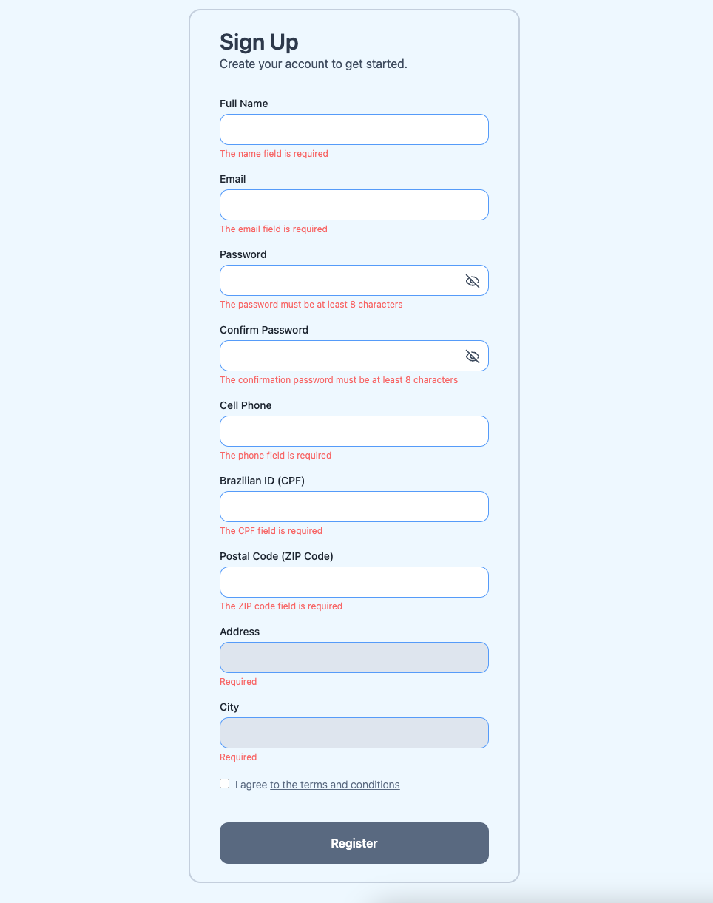

# Dynamic Form with React Hook Form and Zod

Creating a real-world form is not always a trivial task. Nuances such as validation, error messages, and input masks make the process a bit less intuitive. In this Mini Project, you will learn how to create a dynamic registration form using React Hook Form and Zod to streamline development.

React Hook Form and Zod are, respectively, the main industry tools for form management in React and client- and server-side validation.

## 📸 Project Preview

Here are some screenshots of the project to give you an idea of what the form looks like:

*Figure 1: The form's main view.*

*Figure 2: An example of a form validation error.*

All of this is using React, React Hook Form, and Zod.

> **Note**: While the APIs used in this project are designed to work with Brazilian data formats (such as CPF and ZIP code), the form and code are written in English to make the project more accessible and understandable to a wider audience, including potential international collaborators or recruiters. The use of English as the primary language for the form aligns with global development standards and ensures the content is more universally accessible.

## 🤓 Before you start

The design and UI of the front-end are already implemented _in a Vite project_! The goal here is to build the form functionalities and learn how to use the React Hook Form and Zod libraries.

To do so, simply fork the project, clone the code to your machine, install the dependencies, and run `pnpm run dev` or `npm run dev`!

### The API

Your form should be submitted to an API developed by us. The endpoint is `https://apis.codante.io/api/register-user/register`. This API will return a `200` status code if all data is correct; or a `422` status code in case of any validation errors. You must also implement the validation messages returned by the server in your code.

The API documentation is available at <a target="_blank" href="https://apis-docs.codante.io/register-user">https://apis-docs.codante.io/register-user</a>. You will need to refer to it to complete this Mini Project.

> **Note**: The API and its validations are based on Brazilian standards, including formats for CPF (Brazilian ID) and ZIP code. This showcases how applications can be adapted to local data requirements, while the use of English in the code base helps to maintain universal readability and aligns with best practices for global software development.

## 🔨 Requirements

**Button to hide/reveal password**

- Create a button that, when clicked, shows or hides the passwords directly on the form.
- This button should be an icon representing whether the password is hidden or revealed (an icon suggestion is already in the code).
- The button should at least be accessible via keyboard (it should be possible to navigate to it using the `tab` key).

**Phone, ID, and ZIP code masks**

- Implement, either from scratch or using a library, masks for the `phone`, `id`, and `zipcode` inputs.
- Suggestions for the masks are `(00) 00000-0000`, `000.000.000-27`, and `00000-000`, respectively.

**Automatic filling of Address (street) and City after ZIP code is filled**

- After the ZIP code is entered, use a ZIP code API to retrieve the address and city information.
- Populate the address and city inputs with the returned data.

> [!NOTE]  
> Before implementing your solution, think about which event would be best to listen to on this input.

**Using React Hook Form and Zod libraries**

- The entire form should be managed by the `React Hook Form` library.
- The validation should be handled by the `Zod` library.
- Data validation should occur on the front-end according to the specified rules:
    - `name`: required.
    - `email`: required, must be a valid email.
    - `password`: required, minimum of 8 characters.
    - `password_confirmation`: required, minimum of 8 characters.
    - `terms`: required, must be a boolean.
    - `phone`: required, maximum of 20 characters.
    - `id`: required, maximum of 14 characters, must follow the format 000.000.000-00, and must be a valid Brazilian ID (CPF).
    - `zipcode`: required, maximum of 9 characters, must follow the format 00000-000.
    - `address`: required.
    - `city`: required.
- All data should be submitted at once to the Codante API endpoint.

> [!NOTE]  
> Zod is a validation library that works both in _Node_ and _browsers_. This project is a SPA, which means we will only use it in the _browser (client-side)._ 

**Implementation of server-side validation**

In addition to client-side validation, our **API** also performs server-side validation. For instance, the `id` field: on the client-side, we will only check the format of the Brazilian ID (CPF), while on the server-side, the API also validates the CPF using its check digits.

- Implement not only client-side validation but also the error messages returned by the API server-side validation.

## 🔨 Extra challenge for those who want to go further

- Create a success message when the API response is `200`.

## 🎨 Suggested Design

In this Mini Project, you won't need to implement any design - we have already done that for you.

## 👉🏽 What you will practice:

#### Forms with React Hook Form and Zod

- Client-side validation
- Server-side validation
- `schemas` in `zod`
- `react-hook-form` library

#### HTML and React Forms

- HTML forms
- Controlled interactive forms
- Form events (_blur_, _click_)

## Prerequisites

- Basic/intermediate React

### Deploy

🔗 [Link](https://dynamic-form-with-react-hook-form-zod.netlify.app/)
